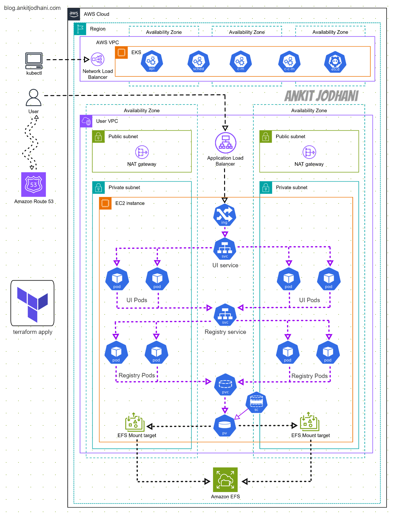

# 🐳 Deploy a Private Docker Container Registry on Kubernetes (EKS)

✨ Welcome to the repository for deploying a private Docker container registry on Kubernetes (EKS) using Terraform. This guide will walk you through setting up an EKS cluster, deploying Kubernetes components, and configuring persistent storage to ensure a scalable and secure setup.

## 📖 Introduction

This project is ideal for those preparing for the Certified Kubernetes Administrator (CKA) exam. Our private container registry will function similarly to Docker Hub, with a persistent volume to avoid losing container images in case of POD or Cluster failure.

## 🎯 Architecture
Understanding the architecture of the project simplifies the process and boosts confidence in following the steps. The architecture involves deploying EKS and associated AWS services, setting up Kubernetes components, and configuring a persistent volume using AWS EFS.

## 🚀 Setup Instructions

Please go through my blog to get more detailed setup by step by instuction

- **Blog:** [🔗 Links](https://blog.ankitjodhani.com/deploy-a-private-docker-container-registry-on-kubernetes-eks/)

## 🙌 Conclusion

In this project, we deployed a private Docker container registry on AWS EKS. We provisioned the infrastructure using Terraform, deployed necessary Kubernetes components, and configured persistent storage to ensure data persistence.

## 🎒 Resources

- [Joxit Docker Registry UI](https://joxit.dev/docker-registry-ui/)
- [Docker Hub](https://hub.docker.com/r/joxit/docker-registry-ui)
- [Medium Article on Private Container Registry](https://medium.com/clarusway/creating-a-private-container-registry-repository-and-web-service-8c753b54f55c)

## 🤙 Contact

If you have any questions or feedback, feel free to reach out:

- **LinkedIn:** [Ankit Jodhani](https://www.linkedin.com/in/ankit-jodhani/)
- **GitHub:** [AnkitJodhani](https://github.com/AnkitJodhani)

---

*If you found this guide helpful, please star the repository and share it with others!*

🙏 Thank you so much for reading..

